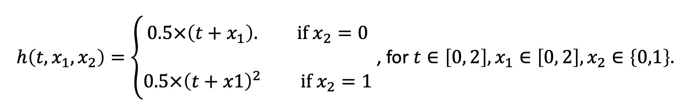
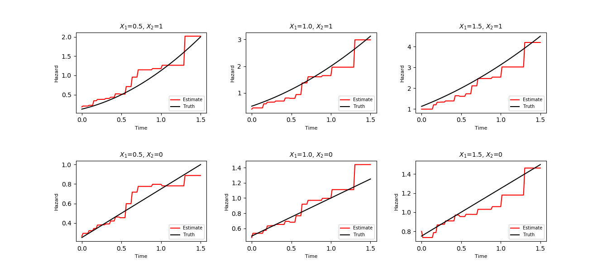

# BoXHED1.0
**B**oosted e**X**act **H**azard **E**stimator with **D**ynamic covariates (BoXHED, pronounced 'box-head') is a software package for nonparametrically estimating hazard functions via gradient boosting. The paper can be found here: [BoXHED: Boosted eXact Hazard Estimator with Dynamic covariates](https://LINK_TBD), which is designed for handling time-dependent covariates in a fully nonparametric manner.

## Prerequisites
The software developed and tested in Linux and Mac OS environments.
- Python (>=3.6)
- numpy
- scipy


```
## Install python module with pip
$ pip install numpy --user
$ pip install scipy --user
```

## Quick Start
This section provides a demonstration of applying BoXHED to a synthetic data example. 
### 1. Clone the BoXHED repository
```
$ git clone https://github.com/BoXHED/BoXHED1.0.git
```
### 2. Go to the software directory
```
$ cd ./BoXHED1.0
```
Open Python and run code in steps 3-8.
### 3. Import modules in Python
```
import sys
sys.path.insert(0, './BoXHED1.0')
import BoXHED
import numpy as np
```
### 4. Read in synthetic data
```
import pickle
dat = pickle.load(open('./BoXHED1.0/dat_2000.pkl', 'rb'))
delta = dat[0]
lotraj = dat[1]
```
This synthetic data contains 20,535 records from 2,000 participants, with 2-29 records per participant. It is simulated from a mixture Weibull distribution whose hazard function is as follows: 



The data consist of two components: 
* **delta**<br>
A *numpy.ndarray* of shape (N, ), where N is the number of participant. Each element in *delta* is a binary indicator which takes value 1 for an observed event and 0 for a right censored event; 
* **lotraj**<br>
A list of *numpy.ndarray* trajectories recording time-dependent covariates of the N participants. For each *numpy.ndarray* in *lotraj*, the first column contains the times of observations, and the other columns record covariates' values observed at the corresponding times. The last row records covariates' values either at the event time or the censoring time (distinguished by the *delta* indicator). 

Below is an example of a participant.
```
In [4]: lotraj[1]
Out[4]: 
array([[0.        , 1.03726853, 1.        ],
       [0.08136604, 1.82575185, 0.        ],
       [0.17317918, 0.66478935, 1.        ],
       [0.22478254, 0.9570905 , 1.        ],
       [0.24163192, 1.75064266, 0.        ],
       [0.40951999, 0.69336698, 0.        ],
       [0.50479024, 1.78439667, 1.        ],
       [0.58278815, 1.5546414 , 1.        ],
       [0.66972005, 1.42502936, 0.        ],
       [0.73479048, 1.5141743 , 0.        ],
       [0.87701472, 0.24338384, 0.        ],
       [0.9056756 , 0.47925883, 0.        ],
       [0.97794846, 0.47925883, 0.        ]])

In [5]: delta[1]
Out[5]: 1  
```
This participant has thirteen records from time 0 to 0.978 with the event of interest occurring at 0.978, where column 0 shows the times at which those records were obtained. A continuous covariate (column 1) and a binary covariate (column 2) are observed in each record.  

### 5. Cross-validation.<br>

*cv* function tunes two hyperparameters: The maximal number of trees (*numtree*) and the maximal number of tree splits (*maxsplit*) using cross-validation. For example, the code below uses 5-fold cross-validation to choose parameters from *maxsplits* &isin;{1, 2, 3, 4, 5}, and *numtrees* &isin;{50, 75, 100, 150, 200}. 

```
grid = BoXHED.cv(delta, lotraj, nfolds = 5, maxsplits=[1, 2, 3, 4, 5], numtrees=[50,75,100,150,200], 
             numtimepartitions=20, numvarpartitions=10, shrink=0.1, cat=[2])
```
Extensive simulation examples show that the hyperparameters (*maxsplit*, *numtree*) = (3, 150) usually return a decent estimator.

**Output:**
```
In [8]: grid
Out[8]: 
array([[247.77890067, 240.8085635 , 238.00450557, 236.14785861, 235.66354096],
       [231.09551694, 228.22918873, 227.30541454, 226.84426871, 227.18943702],
       [227.8165836 , 226.82530813, 226.76250903, 226.83775825, 227.67119837],
       [227.1490613 , 227.31626144, 227.5400673 , 228.56875463, 230.15342036],
       [226.76859047, 227.11129646, 227.63476864, 229.79756029, 232.0965192 ]])
```
*cv* function returns a numpy.ndarray of cross-validated values for the likelihood risk. Each element *grid(i; j)* of the array is the average likelihood risk across $nfolds$ corresponding to a particular combination of (*maxsplit*, *numtree*) = (maxsplits[i], numtrees[j]). Combinations that yield smaller values of the likelihood risk are more desirable. Results above indicate that the optimal combination is (*maxsplit*, *numtree*) = (3,100).

**Syntax**
```
cv(delta, lotraj, nfolds = 5, maxsplits=[2,3,4], numtrees=[10,50,100,200], 
   numtimepartitions=50, numvarpartitions=50, shrink=0.1, cat=None)
```

**Arguments:**
* **delta**<br>
A *numpy.ndarray* of shape (N, ), where N is the number of participant. Each element in *delta* is a binary indicator with 1 for observed event and 0 for right censoring; 
* **lotraj**<br>
A list of *numpy.ndarray* trajectories recording time-dependent covariates of the N participants. For each *numpy.ndarray* in *lotraj*, the first column contains the times of observations, and the other columns record covariates' values observed at the corresponding times. The last row records covariates' values either at the event time or the censoring time (distinguished by *delta* indicator).
* **nfolds**<br>
An integer number that shows the number of folds in *nfolds*-fold cross validation. Default value is 5.
* **maxsplits**<br>
A list of integers that shows the candidate values of *maxsplit* to choose from. Default value is [2,3,4].
* **numtrees**<br>
A list of integers that shows the candidate values of *numtree* to choose from. Default value is [10,50,100,200].
* **numtimepartitions**<br>
An integer number that shows the number of candidate splits on time. The candidate splits are chosen by percentiles. Default value is 50, i.e., candidate splits at the 2nd percentile, 4th percentile, 6th percentile...
* **numvarpartitions**<br>
An integer number that shows the number of candidate splits on covariates. The candidate splits are chosen by percentiles. Default value is 50, i.e., candidate splits at the 2nd percentile, 4th percentile, 6th percentile...
* **shrink**<br>
A float number that represents the shrinkage factor. Default value is 0.1.
* **cat**<br>
A list of integers that shows the indices of categorical covariates (start at 1, since 0 for time which is always continuous). *cat=None* if all the covariates are continuous.

### 6. BoXHED estimator with cross-validated hyperparameter.

*BoXHED* function implements BoXHED method for a given set of hyperparameters. We plug in the optimal hyperparameters from cross-validation to get the BoXHED estimator.
```
estimator = BoXHED.BoXHED(delta, lotraj, maxsplits=3, numtrees=100, 
                          numtimepartitions=20, numvarpartitions=10, cat=[2])
```  
**Output:**
Return an object of class *BoXHED.object* representing the fitted log-hazard function. *BoXHED.object* contains the following components.
* **F0**<br>
Constant hazard estimator that minimizes the likelihood risk.
* **lotrees**<br>
A list of fitted trees generated by the boosting iterations. 
* **varImp**<br>
A dictionary indicating the importance of variables. Keys are the variable indices (0 for time and covariates' indices start at 1). An importance score of a variable is defined as the total reduction of likelihood risk across boosted trees due to splits on that variable.
* **maxsplits**<br>
An integer that shows the hyperparameter *maxsplit* used in BoXHED.
* **numtrees**<br>
An integer that shows the hyperparameter *numtree* used in BoXHED.
* **numtimepartitions**<br>
Refers to arguments description in the function *cv*.
* **numvarpartitions**<br>
Refers to arguments description in the function *cv*.
* **shrink**<br>
Refers to arguments description in the function *cv*.

**Syntax**
```
BoXHED(delta, lotraj, maxsplits=3, numtrees=150, numtimepartitions=20, numvarpartitions=20, shrink=0.1, cat=None)
```

**Arguments:**
Refer to arguments description in the function *cv*.


### 7. Variable Importance
Variable importance scores that show the total reduction in likelihood risk are as follows.
```
In [15]: varImp = estimator.varImp
   ...: print(varImp)
{0: 1065.3733232815687, 1: 1202.0516323347986, 2: 656.3358519088808}
```
Variable importance can be scaled to [0,1] by dividing max(importance_scores) to get the relative importance:

```
In [16]: varImp = list(varImp.values())
   ...: relative_varImp = varImp/max(varImp)
   ...: print(relative_varImp)
[0.88629581 1.         0.54601303]
```
Above results show that the continuous variable is the most important, followed by time. The binary variable is the least important one.

### 8. Prediction on new data.
*predict* function returns the predicted log-hazard function of new data. We make predictions on (t, x) for t&isin;[0, 2] and x1&isin;[0, 2]. To get hazard function values, simply exponentiate the output.

```
# Create new data
t = np.linspace(0,2,100) # time of new data
x = np.linspace(0,2,100) # covariate of new data
tv, xv = np.meshgrid(t,x)
newdata1 = np.column_stack((tv.reshape((tv.size,1)), xv.reshape((xv.size, 1)), np.ones((tv.size,1))))

# prediction
predF1 = BoXHED.predict(estimator, newdata1)
```

**Syntax**
```
predict(estimator, newdata, ntreelimit = np.Inf)
```
**Arguments:**
* **estimator**<br>
A *BoXHED.object* returned by *BoXHED* function.
* **newdata**<br>
A *numpy.ndarray* specifying new data at which to make predictions. The first column is the observation times and the rest of the columns are covariates (same order as training data to get **estimator**).
* **ntreelimit**<br>
An integer that shows the maximal number of trees to use for prediction. If *ntreelimit* is less than the total number of trees in *estimator*, only the first *ntreelimit* trees would be used. Otherwise, all boosted trees will be used in prediction.

**Output:**
Return a *numpy.ndarray* of the same length as **newdata** that contains the predicted log-hazard values.

**Example Output:**




